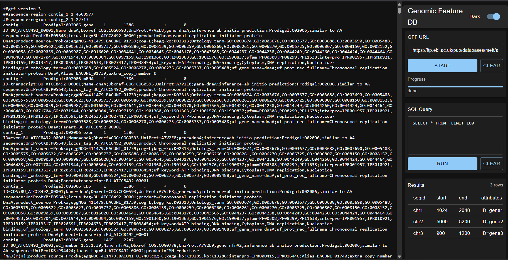

hi i wrote this project to explore how i can run sql queries against large genome-annotation files entirely in the browser, without shipping a database server for every query. this repo shows a lightweight pipeline: parse gff -> create a single sqlite file -> serve it with http range support -> query it from a browser using sqlite compiled to wasm.



## overview

this is a proof-of-concept that i built to let researchers and demo apps query gff3 genome annotations in the browser. instead of downloading and running a full database server, the pipeline converts gff files to a single sqlite file and serves that file so a wasm-based sqlite runtime can request only the pages it needs via http range requests.

the goals:
- let the browser run arbitrary sql against annotation data
- avoid sending the whole file over the wire when possible (http range)
- keep the demo simple and reproducible with the scripts in `src/` and the fastapi backend in `app/`

## how it works (short)

1. backend: i accept a gff url or local gff, parse it with `gffutils` (or the conversion scripts in `src/`) and write a single `.sqlite` file with a simple features schema.
2. serve: the fastapi app serves that `.sqlite` file from `static/` and supports http range requests so wasm's http-vfs can fetch file pages on demand.
3. browser: the extension/ui loads a wasm-based sqlite runtime (sqlite-wasm) inside a worker, mounts the http-vfs pointing at the remote sqlite, runs sql, and returns rows to the ui.
4. visual: the ui shows the generated sql, the range requests, and the rows. a mock jbrowse view uses returned coordinates to center a display.

## technical deep-dive: gff, schema, and conversion

what is gff?
- gff (usually gff3) is a tab-delimited text format for genome feature annotations. each non-comment line has 9 columns:
  1. seqid (chromosome or contig id)
  2. source (where the annotation came from)
  3. type (feature type, e.g., gene, exon, mRNA)
  4. start (1-based start coordinate)
  5. end (end coordinate)
  6. score (usually `.` when not used)
  7. strand (`+` / `-` / `.`)
  8. phase (for cds: 0/1/2 or `.`)
  9. attributes (a semicolon-separated list of key=value pairs)

example gff line (simplified):

```
chr1	ensembl	gene	11869	14409	.	+	.	ID=gene:ENSG00000223972;Name=ddx11l1;biotype=processed_pseudogene
```

how that maps to a database:
- each gff line becomes a row in a `features` table with columns for seqid, source, type, start, end, score, strand, phase, and a stable id.
- attributes are key/value pairs; i store them either as a separate `attributes` table (feature_id, key, value) or as a json/text blob on the feature row. both have tradeoffs: a separate table is normalized and easier to index per-key, json is compact and sometimes faster for simple lookups.

conversion steps i use in the scripts:
1. parse gff (gffutils or a streaming parser) and emit normalized rows.
2. insert rows into sqlite in batches for speed.
3. extract attributes into `attributes(feature_id, key, value)` or write them as json in `features.attributes`.
4. create indexes: at minimum `idx_features_seqid_start_end` (seqid, start, end) and an index on `type`. this makes range queries fast for a given contig and coordinate window.
5. vacuum/optimize the sqlite file so it is compact for transfer.

sqlite vs postgres (conceptually)
- the schema is portable: features + attributes + indexes work the same in postgres. the main differences:
  - postgres gives richer indexing options (jsonb, gin, gist for ranges), better concurrency, and generally larger-scale performance.
  - sqlite is single-file and ideal for distribution to clients or for wasm runtimes; postgres is server-based and better for heavy, multi-user workloads.

practical note: if you want a postgres import, keep the same table layout and bulk-load with `COPY` or use a script to create a matching schema and insert rows.

## what each piece does (roles)

- `fastapi` (in `app/`): accepts conversion requests, runs the conversion scripts (or proxies to them), writes `.sqlite` files into `static/`, and serves static files with http range support (`accept-ranges: bytes` and 206 partial responses). range support is required for the browser http-vfs pattern.

- `gffutils` / `src/` scripts: parsing and normalization helpers. `gffutils.create_db` can build a sqlite db directly from gff; alternatively the `src/` scripts show a lightweight, explicit pipeline (parse → transform → insert → index).

- the `.sqlite` file: a single-file relational database that contains the features and indexes. its page-size and layout let an http-vfs fetch just the pages needed for queries when accessed by sqlite-wasm.

- http-range / http-vfs: the wasm sqlite runtime uses an http virtual file system that maps sqlite page reads to http range requests. the server must support byte-range responses; wasm fetches specific byte ranges (usually page-sized) rather than the entire file.

- `sqlite-wasm`: sqlite compiled to webassembly. it runs in the browser and executes sql locally against the mounted vfs. this lets the browser perform complex queries without a roundtrip to a database server.

- wasm worker (`extension/src/wasmWorker.js`): runs sqlite-wasm in a web worker to avoid blocking the ui thread. the main thread posts requests (open db, run sql) and the worker streams back rows and status, plus optionally logs of range requests.

- extension ui: simple controls to provide a db url and sql, a visual log of range requests and engine steps, and a mock jbrowse view that centers on coordinates returned by queries.

## dev quickstart

backend (python):

```powershell
cd "c:\users\mrsha\desktop\killinit\new folder (3)"
python -m venv .venv
.venv\scripts\activate
pip install -r requirements.txt
uvicorn app.main:app --reload --port 8000
```

extension (frontend):

```bash
cd extension
npm install
npm run dev
```


